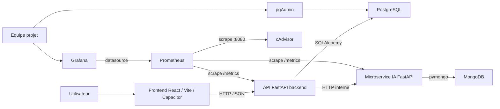

# Architecture HealthAI Coach

## Description de l'architecture

HealthAI Coach repose sur une architecture en services separes :

- un frontend React/Vite pour l'interface utilisateur et la couche mobile Capacitor
- une API FastAPI principale pour la logique metier, la persistance relationnelle et le fil social
- un microservice IA FastAPI pour les recommandations nutrition, sport et vision
- PostgreSQL pour les donnees metier
- MongoDB pour la persistance souple des recommandations IA
- Prometheus, Grafana et cAdvisor pour la supervision locale

Cette separation permet de garder le backend metier stable tout en faisant evoluer le microservice IA et le monitoring de maniere independante.

## Role de chaque service

- `frontend` : consomme l'API backend, affiche les parcours utilisateur, le feed social et les ecrans de recommandations
- `api` : expose les endpoints metier, accede a PostgreSQL, centralise les appels vers le microservice IA et expose `/metrics`
- `ai_service` : calcule les recommandations nutrition et sport, analyse les repas et expose `/health` et `/metrics`
- `db` : stocke utilisateurs, aliments, sessions, logs nutritionnels et donnees sociales
- `mongo` : stocke les traces et resultats de recommandations IA
- `prometheus` : scrape les metriques de `api`, `ai_service` et `cadvisor`
- `grafana` : visualise les metriques collectees par Prometheus
- `cadvisor` : expose les metriques d'usage des conteneurs Docker
- `pgadmin` : aide a l'inspection locale de PostgreSQL pendant la demo

## Flux de communication

- le frontend appelle l'API backend via HTTP
- l'API backend lit et ecrit dans PostgreSQL
- l'API backend appelle le microservice IA pour les recommandations
- le microservice IA lit et ecrit dans MongoDB pour journaliser ses resultats
- Prometheus scrape les metriques de l'API, du microservice IA et de cAdvisor
- Grafana interroge Prometheus pour afficher les tableaux de bord

## Schema Mermaid

## Points d'attention pour la soutenance

- le frontend n'est pas lance par Docker Compose et demarre via `npm run dev`
- le backend principal conserve un mode degrade si le microservice IA n'est pas disponible
- le microservice IA conserve aussi un mode degrade et ne tombe plus en erreur si MongoDB ou la journalisation echouent
